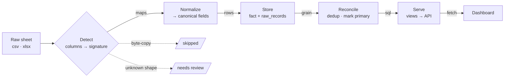
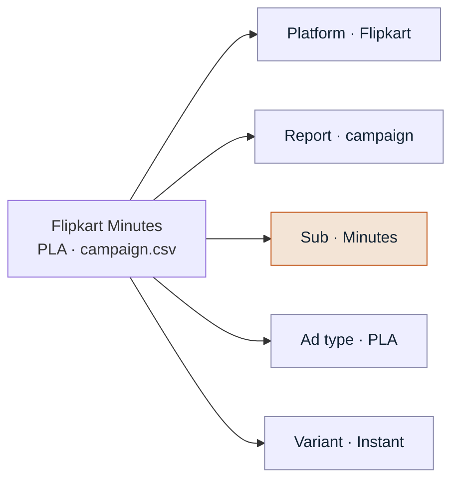
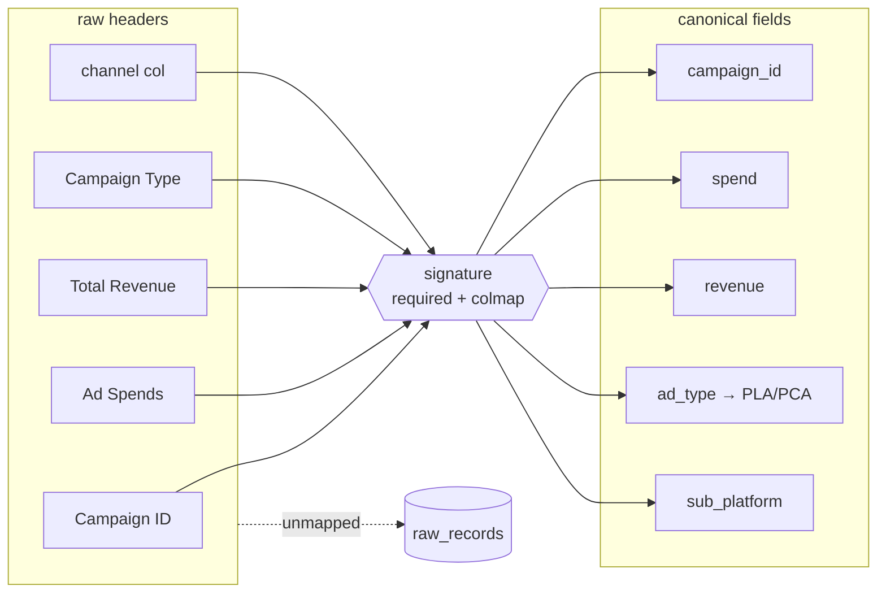
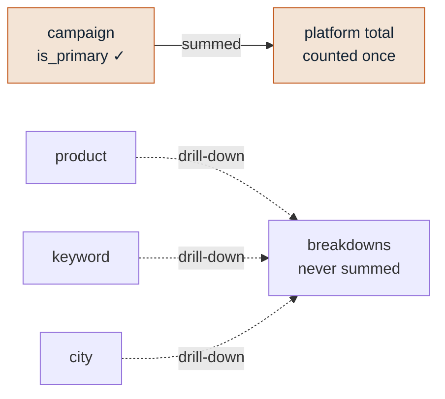

# Data Flow & Sheet Model

How a raw platform export becomes a number on the dashboard. The rule underneath
everything: **content over container** — a file's *columns* decide what it is;
folder and filename are only fallbacks.

> Visual version: the same design as a page — pipeline, the five-dimension model,
> signatures, and primary-grain de-duplication.

---

## 1. The pipeline

A file enters once and moves left to right. The only place it can leave early is
**Detect**: an exact byte-copy is skipped, and an unknown column shape is parked
for review instead of being guessed.

`Detect` is the only decision point that can remove a file. Everything that
survives is stamped with five tags and flows straight through.

---

## 2. The classification model — five questions per sheet

Each tag is read from a **different source**, and a source *inside* the file always
beats one *outside* it. That is what lets an uploaded file classify correctly with
no folder at all.

| Dimension | Read from | Example values |
|---|---|---|
| **Platform** | column signature | Amazon · Flipkart · Zepto · Instamart · BigBasket · Blinkit |
| **Report type** | column signature | campaign · product · keyword · city · placement · budget |
| **Sub-platform** | channel column → folder | Minutes · National (Flipkart) / PLA · PCA (Zepto) |
| **Ad type** | `Campaign Type` column | PLA · PCA · Sponsored Product |
| **Variant** | filename tag · row text · folder | Instant · Filter · Cold · **Generic** (`IC`/`FC`/`CC`) |

- **Sub-platform** reads the fulfilment-channel column — `HYPERLOCAL` = Minutes,
  `FLIPKART` = National — so the file is self-describing (folder only as fallback).
- **Ad type** reads `Campaign Type` and folds `Product Listing Ads → PLA`,
  `Product Contextual Ads → PCA`. Zepto's `Campaign Type` is a *bid strategy*
  (`AUCTION_UP_SELL`, …), **not** PLA/PCA, so it is deliberately not mapped to
  `ad_type`; the signature's PLA/PCA stands.

---

## 3. Inside a signature

A signature is a small contract: a **required** set of column names that must all
be present (the gate), and a **colmap** from each raw header to one canonical field.
Match the set, map the headers, and every platform's vocabulary lands in the same
shape. Unmapped columns are kept verbatim in `raw_records`.

**Adding a new export = adding one signature.** Detection, storage, and totals are
untouched. See `platform/etl/signatures.py`; the matcher is `detect()`, scoring on
the required set and breaking ties by specificity (most columns explained wins).

---

## 4. Why the totals are honest

Every platform ships the **same money** at several grains — a campaign report, and
product / keyword / city breakdowns of it. Summing all of them would double-count.
So one grain per (platform, sub-platform) is marked **primary** (campaign, when
present); the rest are drill-downs the totals never touch.

Totals read `is_primary` only (`PRIMARY_PRIORITY` in `signatures.py`). If a platform
is missing its campaign report, the priority falls to `product` automatically; when
a real campaign export arrives, it takes over with no code change. **A missing report
shows as a gap, never as a wrong number.** Blinkit is the exception — its formats are
genuinely distinct ad products that *add* (`ADDITIVE_REPORTS`).

---

## 5. Model improvements

| # | Improvement | Status |
|---|---|---|
| 1 | Surface **"partial — no campaign report"** beside a total instead of showing a quietly-low number | planned |
| 2 | Name the **Generic / all-products** bucket for GKT/Auto campaigns (were blank) | **done** |
| 3 | Raise a **review flag** when content ≠ folder (e.g. a Zepto file in a BigBasket folder) | planned |
| 4 | Keep **billed vs tracked** (overrides) visible as a completeness signal | done |

### The rules that hold it together
- **Content over container.** Columns decide identity; folder and filename are fallbacks.
- **Add a shape, not a special case.** A new export = one new signature.
- **Never invent a number.** Duplicates skipped, unknowns parked, missing reports read
  as gaps. The dashboard may be incomplete — never wrong.

---

## Map to the code

| Stage | Where |
|---|---|
| Detect / signatures | `platform/etl/signatures.py` (`SIGNATURES`, `detect`, `PRIMARY_PRIORITY`) |
| Classify (5 tags) | `platform/etl/ingest.py` (`parse_file`, `_flipkart_sub_platform`, `_category_from_path`) |
| Normalize → canonical | `platform/etl/normalize.py` (`_infer_category`, PLA/PCA fold) |
| Load + primary grain | `platform/etl/load.py`, `platform/etl/run.py` |
| Serve | `platform/db/views.sql`, `platform/api/main.py` |
| Read | `dashboard/` |
